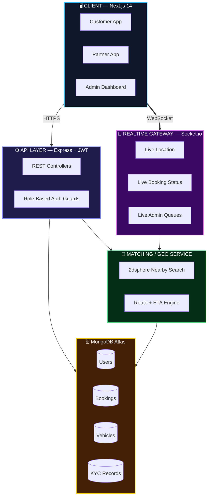
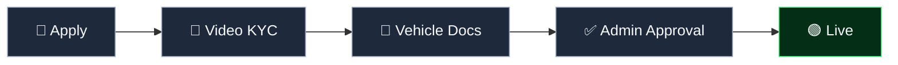

<div align="center">


### Book any vehicle. Bikes to heavy trucks. One platform.

[](https://nextjs.org/)
[](https://nodejs.org/)
[](https://www.mongodb.com/)
[](https://socket.io/)
[](https://velocity-three-xi.vercel.app)
[](#license)

**[Live Demo](https://velocity-three-xi.vercel.app)** &nbsp;·&nbsp; **[Report Bug](#)** &nbsp;·&nbsp; **[Request Feature](#)**

</div>

<br/>

## ✨ What is RYDEX

A multi-vehicle booking platform — Bike, Auto, Car, Loading, Truck — with real customer/partner/admin roles, live tracking, and a partner verification pipeline. Not a toy clone.

<br/>

## 🧱 Stack

| Layer | Tech |
|---|---|
| Frontend | Next.js 14 · React 18 · Tailwind |
| Auth | NextAuth (Auth.js) · Google OAuth |
| Realtime | Socket.io (standalone server) |
| Video/Voice | ZegoCloud |
| Maps & Geocoding | Geoapify |
| Media Storage | Cloudinary |
| Payments | Razorpay |
| AI | Google Gemini API |
| Email | Nodemailer (Gmail SMTP) |
| Database | MongoDB Atlas (geospatial) |
| Deploy | Vercel (web) + persistent Node host (Socket.io) |

<br/>

## 🚀 Features

**Customer**
- 5 vehicle classes in one booking flow
- Live route preview — distance + ETA before you confirm
- Clean empty states (`No vehicles found` → `Retry`)
- Booking history

**Partner**
- Guided onboarding
- Video KYC
- Vehicle document review
- Live assigned-rides queue

**Admin**
- Partner counts at a glance — total / approved / pending / rejected
- 3 review queues: partner KYC, video KYC, vehicle docs
- Daily earnings — best day, daily avg, today, week-over-week
- Zero-state clarity: `All caught up!`

<br/>

## 🏗️ Architecture



**Durable state** (bookings, KYC, earnings) → REST + MongoDB.
**Ephemeral state** (live location, live status, live queue counts) → Socket.io.

This split is the core design decision: nothing that's only true "right now" ever touches a database write.

<br/>

## 🔒 Partner Verification



Three independent gates, not one boolean — identity, vehicle, and admin sign-off can each fail for different reasons.

<br/>

## 📡 Realtime Events

| Event | Scope |
|---|---|
| `booking:status` | `booking:<id>` |
| `partner:location` | `booking:<id>` |
| `booking:new` | nearby partners |
| `admin:queue:update` | admin |

<br/>

## 🗂️ Data Model

```
User      → role: customer | partner | admin
Partner   → kycStatus, kycVideoUrl
Vehicle   → type, location (2dsphere), documents, reviewStatus
Booking   → vehicleType, pickup, drop, distanceKm, etaMinutes, status
Earnings  → partnerId, date, amount
```

<br/>

## 🔌 API

```
POST   /api/v1/auth/register
POST   /api/v1/auth/login

POST   /api/v1/bookings
GET    /api/v1/bookings/mine
PATCH  /api/v1/bookings/:id/status

GET    /api/v1/vehicles/nearby
PATCH  /api/v1/vehicles/:id/review      # admin

POST   /api/v1/partners/apply
POST   /api/v1/partners/kyc-video
PATCH  /api/v1/partners/:id/approve     # admin

GET    /api/v1/admin/dashboard/summary
```

<br/>

## 📁 Structure

```
rydex/
├── apps/
│   ├── web/   → Next.js (customer / partner / admin)
│   └── api/   → Express (controllers, models, sockets, services)
└── packages/shared/
```

<br/>

## ⚡ Quick Start

```bash
git clone https://github.com/<your-org>/rydex.git
cd rydex && npm install --workspaces

cd apps/api && npm run dev      # :4000
cd apps/web && npm run dev      # :3000
```

**`.env` (Next.js app)**
```env
MONGODB_URL="mongodb+srv://<user>:<password>@<cluster>.mongodb.net"
AUTH_SECRET="<generate-with-openssl-rand-base64-32>"

AUTH_GOOGLE_ID="<google-oauth-client-id>"
AUTH_GOOGLE_SECRET="<google-oauth-client-secret>"

EMAIL="<gmail-address>"
PASS="<gmail-app-password>"

CLOUDINARY_CLOUD_NAME="<cloudinary-cloud-name>"
CLOUDINARY_API_KEY="<cloudinary-api-key>"
CLOUDINARY_API_SECRET="<cloudinary-api-secret>"

NEXT_PUBLIC_ZEGO_APP_ID="<zego-app-id>"
NEXT_PUBLIC_ZEGO_SERVER_SECRET="<zego-server-secret>"

NEXT_PUBLIC_SOCKET_SERVER_URL="http://localhost:8000"
NEXT_PUBLIC_GEOAPIFY_API_KEY="<geoapify-api-key>"

RAZORPAY_KEY_ID="<razorpay-key-id>"
RAZORPAY_KEY_SECRET="<razorpay-key-secret>"
NEXT_PUBLIC_RAZORPAY_KEY_ID="<razorpay-key-id>"

GEMINI_API_URL="https://generativelanguage.googleapis.com/v1beta/models/<model>:generateContent?key=<gemini-api-key>"

NEXT_BASE_URL="http://localhost:3000"
```

**`.env` (Socket.io server)**
```env
PORT=8000
MONGODB_URL="mongodb+srv://<user>:<password>@<cluster>.mongodb.net"
```

> ⚠️ **Never commit `.env` files.** Add them to `.gitignore` and use your host's secret manager (Vercel Environment Variables, etc.) in production. If any real credentials were ever pasted into a chat, ticket, or commit — rotate them immediately.

<br/>

## 🧪 Testing

```bash
npm run test        # unit + integration
npm run test:e2e     # end-to-end
```

<br/>

## 🗺️ Roadmap

- [ ] Surge pricing
- [ ] In-app chat
- [ ] Payments
- [ ] OCR-based auto KYC
- [ ] Multi-language

<br/>

## 🤝 Contributing

```bash
git checkout -b feature/your-feature
git commit -m "feat: add live ETA recalculation"
```
Open a PR with a clear description + screenshots for UI changes.

<br/>

## 📄 License

MIT

<br/>

<div align="center">

**Built for the hard parts — trust, geo-matching, real-time state.**

</div>
